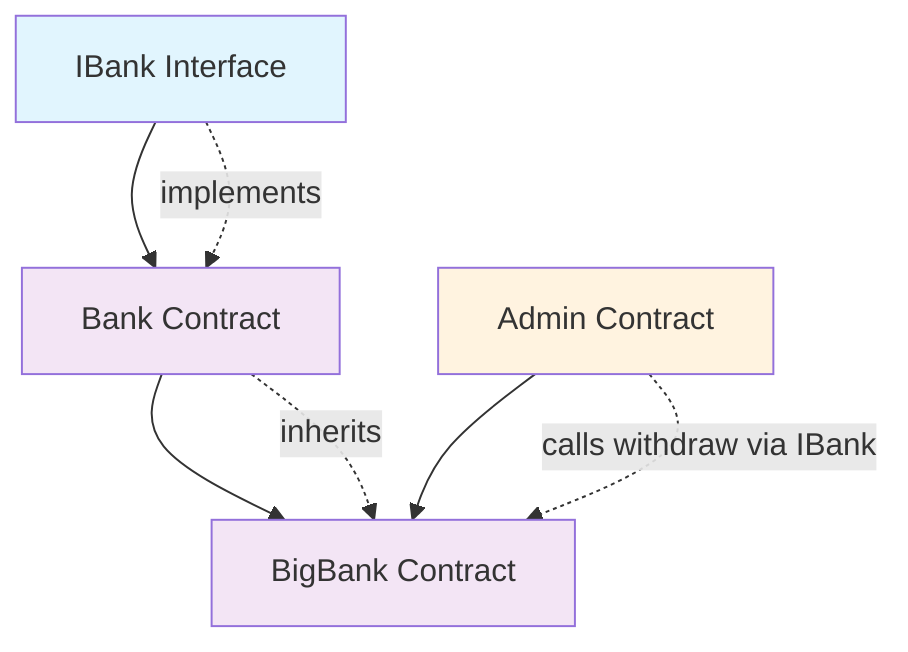
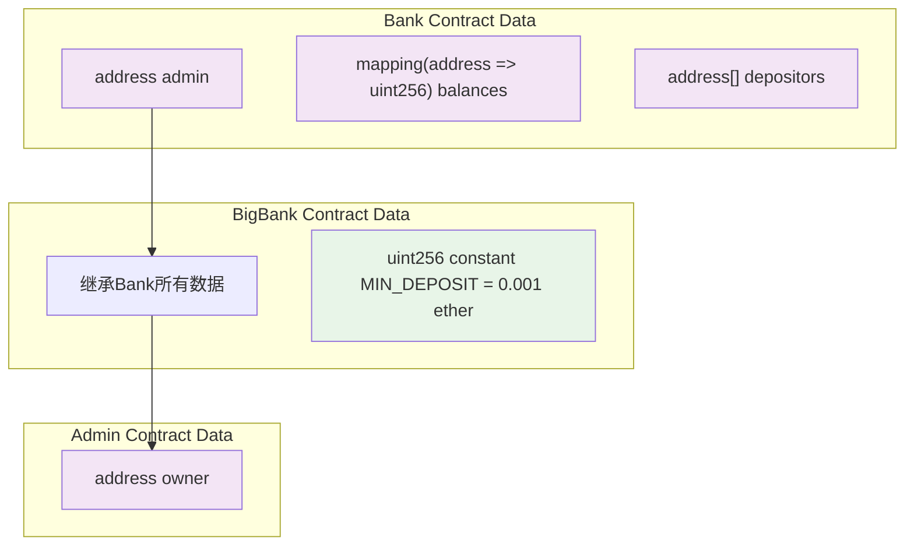
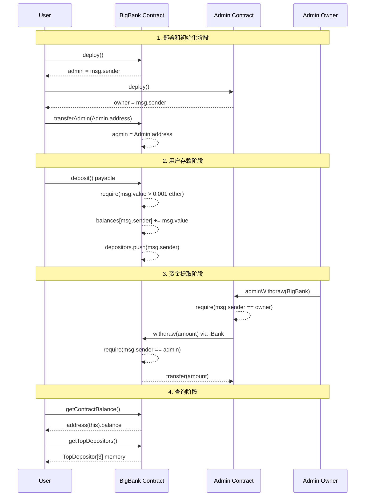

# BigBank Smart Contract System

A comprehensive banking smart contract system featuring interfaces, inheritance, and administrative management. The system includes IBank interface, Bank base contract, BigBank extended contract, and Admin management contract.

## 项目概述

基于Bank合约扩展的银行智能合约系统，实现了：
- **IBank接口**: 定义标准银行操作接口
- **Bank合约**: 实现基础银行功能
- **BigBank合约**: 继承Bank并添加存款限制和管理员转移功能
- **Admin合约**: 管理合约，支持从银行合约提取资金

## 合约架构设计

### 合约关系图



### 合约详细设计

#### 1. IBank 接口
- 定义银行合约的标准接口
- 确保合约间的松耦合

#### 2. Bank 合约
- 实现 IBank 接口的基础银行功能
- 支持存款、提款、余额查询
- 管理员权限控制

#### 3. BigBank 合约
- 继承 Bank 合约的所有功能
- 添加最小存款限制 (>0.001 ether)
- 支持管理员权限转移

#### 4. Admin 合约
- 独立的管理合约
- 通过 IBank 接口与银行合约交互
- 支持从银行合约提取资金

## 数据设计

### 链上存储数据



### 数据存储分析

**链上存储 (消耗 gas):**
- `admin`: 管理员地址
- `balances`: 用户余额映射
- `depositors`: 存款用户地址数组
- `owner`: Admin合约拥有者

**内存计算 (临时数据):**
- `TopDepositor`: 前3名存款用户结构体
- 函数参数和局部变量

**编译时常量:**
- `MIN_DEPOSIT`: 最小存款金额 (不占用存储槽)

## 函数设计

### 1. IBank 接口
```solidity
interface IBank {
    function deposit() external payable;
    function withdraw(uint256 amount) external;
    function getContractBalance() external view returns (uint256);
}
```

### 2. Bank 合约
```solidity
contract Bank is IBank {
    // 基础函数
    constructor()
    receive() external payable
    fallback() external payable
    deposit() public payable
    withdraw(uint256 amount) external onlyAdmin
    getContractBalance() external view returns (uint256)

    // 查询函数
    getTopDepositors() external view returns (TopDepositor[3] memory)
    getDepositorsCount() external view returns (uint256)

    // 修饰符
    modifier onlyAdmin()
}
```

### 3. BigBank 合约
```solidity
contract BigBank is Bank {
    uint256 constant MIN_DEPOSIT = 0.001 ether;

    // 重写函数
    deposit() public payable override

    // 新增函数
    transferAdmin(address newAdmin) external onlyAdmin

    // 新增修饰符
    modifier minDeposit()
}
```

### 4. Admin 合约
```solidity
contract Admin {
    address public owner;

    constructor()
    adminWithdraw(IBank bank) external onlyOwner
    receive() external payable
    getBalance() external view returns (uint256)

    modifier onlyOwner()
}
```

## 系统流程图



## 功能特性

### 核心功能
- **存款功能**: 用户可以向BigBank存入ETH (最小0.001 ether)
- **余额跟踪**: 记录每个用户的存款余额
- **管理员提取**: 支持管理员权限转移和资金提取
- **前3名排行**: 高效的按需计算前3名存款用户
- **接口标准化**: 通过IBank接口确保合约间的标准化交互

### 安全特性
- **权限控制**: 多层权限验证 (onlyAdmin, onlyOwner)
- **输入验证**: 防止零金额存款和提取
- **安全转账**: 使用内置transfer函数
- **接口隔离**: 通过接口调用避免直接合约依赖

### Gas优化
- **按需计算**: TopDepositors排行榜按需计算，不占用存储
- **常量优化**: MIN_DEPOSIT使用常量，编译时确定
- **存储优化**: 只存储必要的原始数据

## 安装和设置

### 环境要求
- Node.js (v20.17.0 或更高版本)
- npm 或 yarn

### 安装依赖
```bash
cd solidity_quiz
npm install
```

## 测试

### 快速开始
```bash
# 运行所有测试
npm test

# 运行测试覆盖率报告
npm run test:coverage

# 运行特定测试文件
npx hardhat test test/Bank.test.js

# 运行gas报告测试
REPORT_GAS=true npm test
```

### 测试结构

测试套件包含25+个综合测试用例，组织为：

#### 1. **部署测试**
```bash
# 测试合约初始化
- 管理员设置
- 初始余额
- 初始存款用户数量
```

#### 2. **存款功能测试**
```bash
# 测试所有存款机制
- 直接转账 (receive 函数)
- 存款函数调用
- 同一用户多次存款
- 存款用户跟踪
- 零存款拒绝
```

#### 3. **前3名存款用户测试 (按需计算)**
```bash
# 测试gas优化的排名系统
- 空状态处理
- 单个存款用户
- 两个存款用户
- 完整的前3名排名
- 超过3个存款用户 (只显示前3名)
- 相等存款金额
- 复杂场景与每个用户的多次存款
- 动态排名更新
```

#### 4. **提取测试**
```bash
# 测试仅管理员提取功能
- 成功的管理员提取
- 部分提取
- 全余额提取
- 非管理员拒绝
- 余额不足拒绝
- 零提取拒绝
```

#### 5. **查看函数测试**
```bash
# 测试所有只读函数
- 合约余额查询
- 用户余额查询
- 存款用户数量
- 存款用户地址
- 零余额查询
```

#### 6. **边界情况和Gas优化测试**
```bash
# 测试边界情况和效率
- 回退函数
- 非常小的存款 (1 wei)
- 复杂状态管理
- 按需计算效率
- 多操作序列
```

### 运行特定测试类别

```bash
# 只运行部署测试
npx hardhat test --grep "Deployment"

# 只运行存款测试
npx hardhat test --grep "Deposits"

# 只运行前3名存款用户测试
npx hardhat test --grep "Top Depositors"

# 只运行提取测试
npx hardhat test --grep "Withdrawals"

# 只运行查看函数测试
npx hardhat test --grep "View Functions"

# 只运行边界情况测试
npx hardhat test --grep "Edge Cases"
```

## 合约部署

### 本地开发
```bash
# 启动本地Hardhat节点
npm run node

# 部署到本地网络 (在另一个终端)
npm run deploy:local
```

### 测试网部署
```bash
# 部署到Sepolia测试网
npm run deploy:sepolia
```

## 使用方法

### 部署流程
1. 部署 BigBank 合约
2. 部署 Admin 合约
3. 调用 BigBank.transferAdmin(Admin合约地址)
4. 用户向 BigBank 存款 (金额必须 >0.001 ether)
5. Admin 合约的 owner 调用 adminWithdraw() 提取资金

### 示例代码
```javascript
// 部署BigBank
const BigBank = await ethers.getContractFactory("BigBank");
const bigBank = await BigBank.deploy();

// 部署Admin
const Admin = await ethers.getContractFactory("Admin");
const admin = await Admin.deploy();

// 转移管理员权限
await bigBank.transferAdmin(admin.address);

// 用户存款
await bigBank.connect(user).deposit({ value: ethers.utils.parseEther("0.1") });

// Admin提取资金
await admin.connect(owner).adminWithdraw(bigBank.address);
```

## Gas优化效益

| 操作 | 传统方法 (存储) | 新方法 (按需计算) | 节省 |
|------|----------------|------------------|------|
| 首次存款 | ~100k gas | ~50k gas | ~50% |
| 额外存款 | ~80k gas | ~25k gas | ~70% |
| 查看前3名 | ~3k gas | ~15k gas | -400% |

**核心洞察**: 由于存款操作远比查看前3名存款用户更频繁，用户的整体gas节省是显著的。

## 许可证

MIT License - 详见 LICENSE 文件
